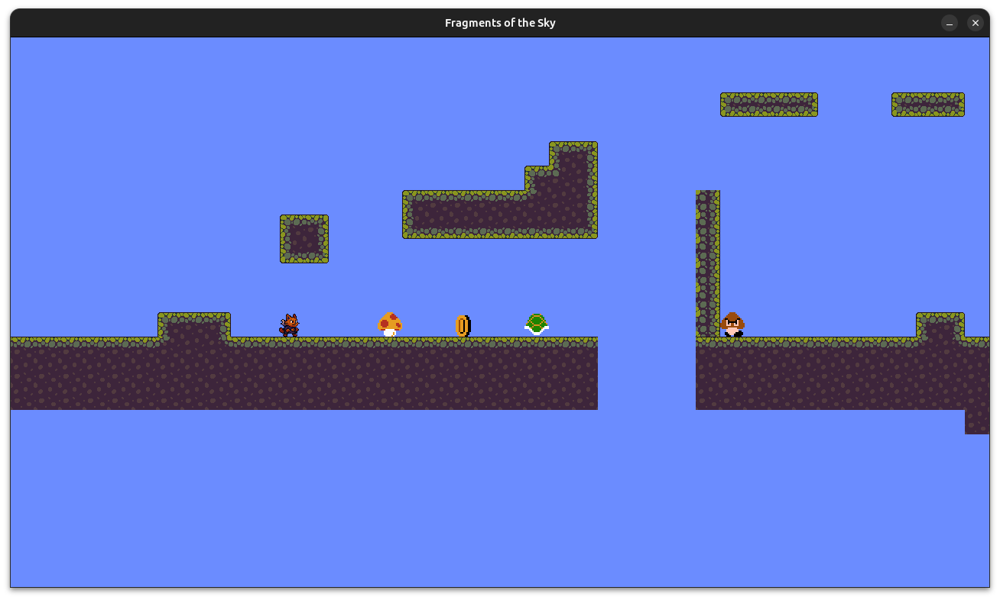
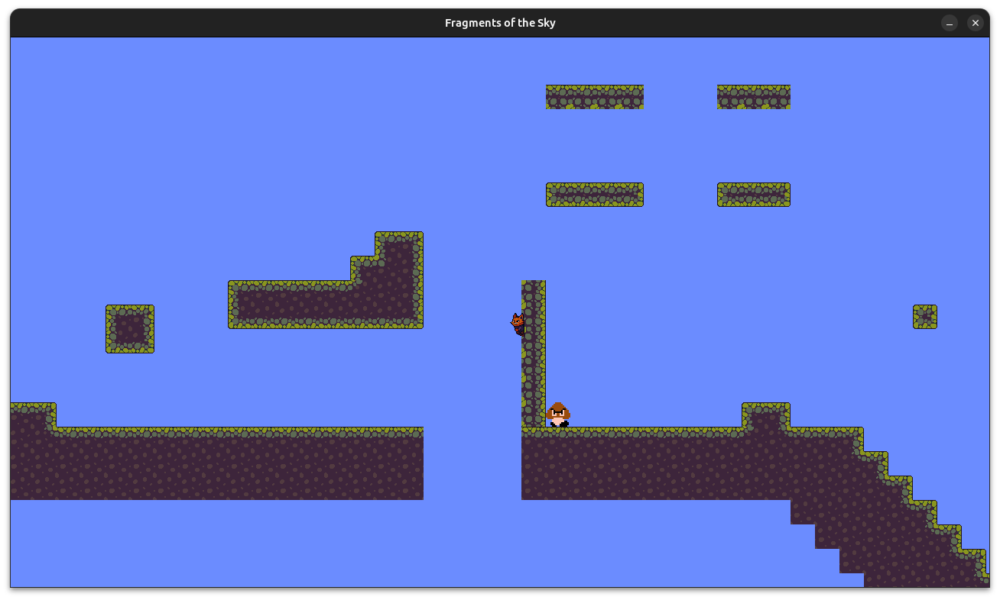
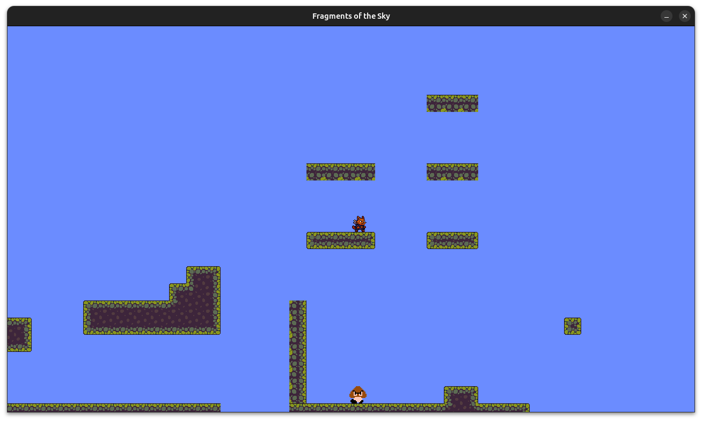
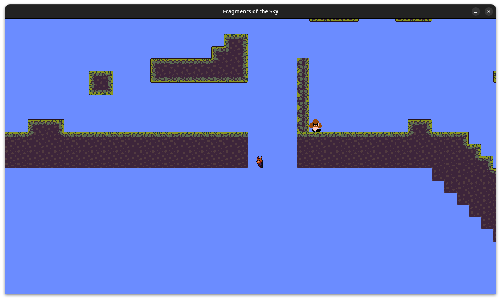
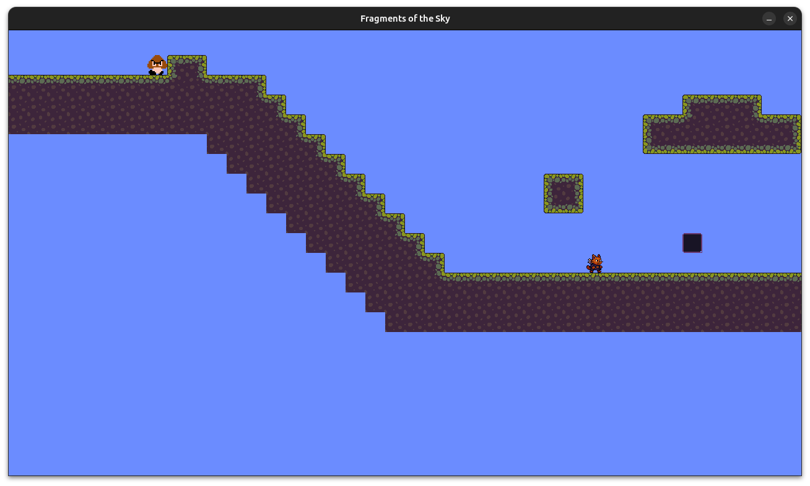

# Fragments of the Sky

## Screenshots

## Descrição

Fragments of the Sky é um jogo de plataforma 2D centrado em uma jornada de autodescoberta da protagonista Aeris, uma
gata angorá que acorda sem memórias em uma ilha flutuante. Com a ajuda de uma bússola mágica, ela parte em busca de
Fragmentos de Éter espalhados por diferentes biomas suspensos no céu. A narrativa é contada de forma ambiental e
indireta, revelando lentamente os mistérios do mundo e da própria Aeris à medida que o jogador avança.

As mecânicas básicas incluem corrida, salto, pulo duplo, dash e escalada de paredes, sendo desbloqueadas
progressivamente conforme os Fragmentos de Éter são obtidos. Essa evolução amplia as possibilidades de exploração,
introduz desafios de plataforma mais complexos e incentiva o retorno a áreas previamente inacessíveis. A jogabilidade
foca em movimentação precisa e resolução de quebra-cabeças, com desafios baseados em percepção e lógica.

O jogo termina com um confronto final e uma decisão narrativa importante, coroando uma progressão não-linear por quatro
ilhas temáticas. A condição de vitória está atrelada à coleta de todos os Fragmentos e à superação dos desafios das
ilhas, enquanto a derrota pode vir da falha em superar os obstáculos, inimigos e enigmas ao longo do caminho. Com arte
em pixel art, trilha sonora dinâmica e desafios ao jogador, Fragments of the Sky oferece uma experiência imersiva,
emocional e altamente rejogável.

## Funcionalidades a serem testadas

- Itens coletáveis:
    - Duplo pulo (Cogumelo).
    - Dash (Moeda).
    - Escalada de paredes (Casca do Koopa).
- Descer de plataformas.
- Subir plataformas.
- Interação com menu.
- Música e efeitos sonoros.
- Mecânica de plataforma e movimentação do personagem.
- Inimigos com comportamento de perseguição ao jogador.
- Condição de derrota: inimigo encostar no jogador ou cair no _void_ (colisão com um bloco invisível).
- Condição de vitória: chegar ao final da fase e colidir com o bloco de _win_ trigger.

## Créditos

- Gabriel Teixeira Carvalho (mapa, sprites)
- Gabriel M. M. Fialho (sprites e mecânicas de movimentação)
- Marcelo A. S. Ganem (_main menu_, música, efeitos sonoros)
- Thiago Pádua de Carvalho (condição de vitória, coletáveis)
- Vinicius S. Gomes (mecânicas de movimentação, _one way platforms_, inimigos)
